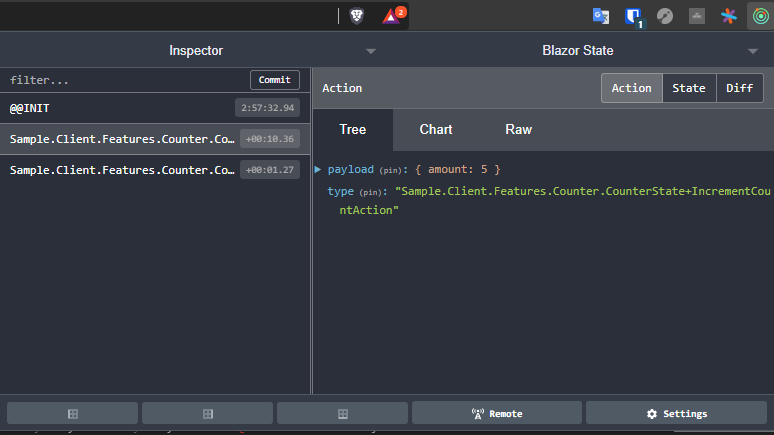
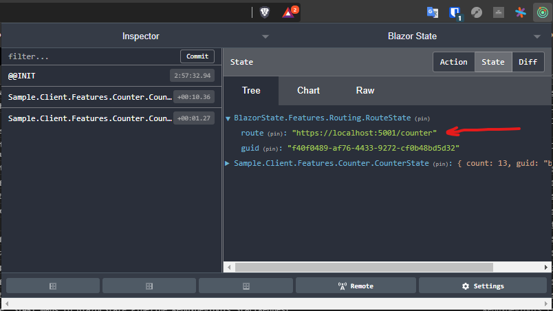

# Blazor-State Tutorial

This tutorial shows how to add Blazor-State to a `Blazor hosted WebAssembly App` application.

## Prerequisites

1. Install the latest [.NET 5.0 SDK](https://dotnet.microsoft.com/download) release.

## Creating the project

1. Create a new project `dotnet new blazorwasm --hosted -n Sample`
2. Change directory to the new project `cd Sample`
3. Run the default application and confirm it works.  
   `dotnet run --project ./Server/Sample.Server.csproj`

You should see something similar to the following:

```console
C:\Temp\Sample> dotnet run --project ./Server/Sample.Server.csproj
info: Microsoft.Hosting.Lifetime[0]
      Now listening on: https://localhost:5001
info: Microsoft.Hosting.Lifetime[0]
      Now listening on: http://localhost:5000
info: Microsoft.Hosting.Lifetime[0]
      Application started. Press Ctrl+C to shut down.
info: Microsoft.Hosting.Lifetime[0]
      Hosting environment: Development
info: Microsoft.Hosting.Lifetime[0]
      Content root path: C:\Temp\Sample\Server
```

Open a browser and enter <http://localhost:5000>

You should see:


Go to the Counter page and click the `Click me` button.
Observe the incrementing of the value.
Return to the home page. Then back to the counter page.

   > [!NOTE]
   > Notice that the counter resets on page changes.
   > There is currently no state being maintained.
   > When the counter page is no longer rendered the component is destroyed.
   > When returning to the counter route a new page is created
   > and therefore the count is back to zero.

## Add Blazor-State

Add the Blazor-State NuGet package to the `Sample.Client` project.
   `dotnet add ./Client/Sample.Client.csproj package Blazor-State`

## Feature File Structure

With the mediator pattern for each `Request/Action` there is an associated `Handler`
and possibly other items like a `Validator`, `Mapper` etc...
These associated items are what we call a `Feature`.
Let's organize the Features by the State they act upon.

1. In the Client project add a folder named `Features`.

## Add CounterState

1. In the `Features` folder add a folder named `Counter`.
2. Within the `Counter` folder create a class file named `CounterState.cs`.

Your class should:

* be a partial class
* inherit from `State<CounterState>`
* override the `Initialize()` method. To set the initial `Count` to 3.

The only value we want to maintain is a Count.
The code for the class should be as follows.

```csharp
namespace Sample.Client.Features.Counter
{
  using BlazorState;

  public partial class CounterState : State<CounterState>
  {
    public int Count { get; private set; }
    public override void Initialize() => Count = 3;
  }
}
```

## Configure the services

1. In the `Sample.Client` project in the `Program.cs` file.
2. Add a `ConfigureServices` method to configure blazor-state as follows:
3. Add the required usings.
4. Configure the options passed to AddBlazorState to include the assemblies to scan for States and Handlers.

```csharp
namespace Sample.Client
{
  using Microsoft.AspNetCore.Components.WebAssembly.Hosting;
  using Microsoft.Extensions.DependencyInjection;
  using System;
  using System.Net.Http;
  using System.Threading.Tasks;
  using BlazorState;
  using System.Reflection;
  using MediatR;

  public class Program
  {
    public static async Task Main(string[] args)
    {
      var builder = WebAssemblyHostBuilder.CreateDefault(args);
      builder.RootComponents.Add<App>("app");
      builder.Services.AddSingleton
      (
        new HttpClient { BaseAddress = new Uri(builder.HostEnvironment.BaseAddress) }
      );

      ConfigureServices(builder.Services);

      await builder.Build().RunAsync();
    }

    public static void ConfigureServices(IServiceCollection aServiceCollection)
    {

      aServiceCollection.AddBlazorState
      (
        (aOptions) =>

          aOptions.Assemblies =
          new Assembly[]
          {
            typeof(Program).GetTypeInfo().Assembly,
          }
      );
    }
  }
}
```

## Displaying state in the user interface

 1. Edit `Pages/Counter.razor` as follows
 2. Inherit from BlazorStateComponent `@inherits BlazorStateComponent`, to do that you need to also add `@using BlazorState`
 3. Next add a `CounterState` property that gets the State from the store `GetState<CounterState>()`, this will require you add `@using Sample.Client.Features.Counter` also.
 4. change `currentCount` to pull the Count from state. `int currentCount => CounterState.Count;`
 5. Notice that inside the `IncrementCount` method the `currentCount`can no longer be incremented. The `CounterState` class is immutable from the outside.
 So lets comment out that line.

The code should look as follows:

```csharp
@page "/counter"
@using BlazorState
@using Sample.Client.Features.Counter

@inherits BlazorStateComponent

<h1>Counter</h1>

<p>Current count: @currentCount</p>

<button class="btn btn-primary" @onclick="IncrementCount">Click me</button>

@code {
    CounterState CounterState => GetState<CounterState>();

    private int currentCount => CounterState.Count;

    void IncrementCount()
    {
        //currentCount++;
    }
}
```

Run the application. On the Counter page, you should notice the count is being displayed as we initialized.
Although the button no longer works.

## Sending requests that will mutate the state

Changes to state are done by sending an `Action` through the mediator pipeline.
The `Action` is then handled by a `Handler` which can freely mutate the state.

> [!Warning]
> State should NOT be mutated by anything other than handlers.
> All state changes should be done in handlers.
> This is controlled by making the states public interface immutable and your handlers a nested class of the state they modify.

## Create the `IncrementCounterAction`

1. In the Client project ensure the path `Features/Counter/Actions/IncrementCount` folder.
2. In this folder create a class named `IncrementCountAction.cs`.

The class should:

* be a nested class of the state it will mutate `CounterState`
* inherit from `IAction`
* have namespace Sample.Client.Features.Counter
* contain the Amount property
as follows:

```csharp
namespace Sample.Client.Features.Counter
{
  using BlazorState;

  public partial class CounterState
  {
    public class IncrementCountAction : IAction
    {
      public int Amount { get; set; }
    }
  }
}
```

## Sending the action through the mediator pipeline

To Send the action to the pipeline when the user clicks the `Click me` button,
In `Pages/Counter.razor` update the `IncrementCount` function as follows:

```csharp
void IncrementCount()
{
    Mediator.Send(new CounterState.IncrementCountAction { Amount = 5 });
}
```

## Handling the action

The `Handler` is where we actually mutate the state to complete the `Action`.  

1. In the `Features/Counter/IncrementCount` folder create a new class file named
 `IncrementCountHandler.cs`

The Handler should:

* be a nested class of the state it will mutate `CounterState`
* Inherit from `BlazorState.Handlers.ActionHandler`.
* The generic parameters are the Request Type `IncrementCountAction` and the return type `Unit` (which is a MediatR version of void).
* Override the `Handle` method to mutate state as desired:

```csharp
namespace Sample.Client.Features.Counter
{
  using System.Threading;
  using System.Threading.Tasks;
  using BlazorState;
  using MediatR;

  public partial class CounterState
  {
    public class IncrementCountHandler : ActionHandler<IncrementCountAction>
    {
      public IncrementCountHandler(IStore aStore) : base(aStore) { }

      CounterState CounterState => Store.GetState<CounterState>();

      public override Task<Unit> Handle(IncrementCountAction aIncrementCountAction, CancellationToken aCancellationToken)
      {
        CounterState.Count = CounterState.Count + aIncrementCountAction.Amount;
        return Unit.Task;
      }
    }
  }
}
```

## Validate

Execute the app and confirm that the "Click me" button properly increments the value.
And when you navigate away from the page and back the value persists.

## ReduxDevTools JavaScript Interop and RouteState

To [enable ReduxDevTools](xref:BlazorState:AddReduxDevTools.md) update the `ConfigureServices` method in `Program.cs` as follows:

```
    public static void ConfigureServices(IServiceCollection aServiceCollection)
    {
      aServiceCollection.AddBlazorState
      (
        (aOptions) =>
        {
          aOptions.UseReduxDevToolsBehavior = true;
          aOptions.Assemblies =
            new Assembly[]
            {
              typeof(Program).GetTypeInfo().Assembly,
            };
        }
      );
    }
```

To facilitate JavaScript Interop, enable ReduxDevTools, and manage RouteState, add `App.razor.cs` in the same directory as `App.razor` as follows:

```csharp
namespace Sample.Client
{
  using System.Threading.Tasks;
  using BlazorState.Pipeline.ReduxDevTools;
  using BlazorState.Features.JavaScriptInterop;
  using BlazorState.Features.Routing;
  using Microsoft.AspNetCore.Components;

  public partial class App : ComponentBase
  {
    [Inject] private JsonRequestHandler JsonRequestHandler { get; set; }
    [Inject] private ReduxDevToolsInterop ReduxDevToolsInterop { get; set; }

    // Injected so it is created by the container. Even though the IDE says it is not used, it is.
    [Inject] private RouteManager RouteManager { get; set; }

    protected override async Task OnAfterRenderAsync(bool firstRender)
    {
      await ReduxDevToolsInterop.InitAsync();
      await JsonRequestHandler.InitAsync();
    }

  }
}
```
Lastly we need to add the blazor-state JavaScript to the `index.html` file just above the `blazor.webassembly.js` reference:

```
...
<script src="_content/Blazor-State/blazorstate.js"></script>
<script src="_framework/blazor.webassembly.js"></script>
...
```

Now run your app again and then Open the Redux Dev Tools (a tab in Chrome Dev Tools) and you should see Actions as they are executed.



If you inspect the State in the DevTools you will also notice it maintains the current Route in RouteState.



Congratulations that is the basics of using getting started with Blazor-State.
